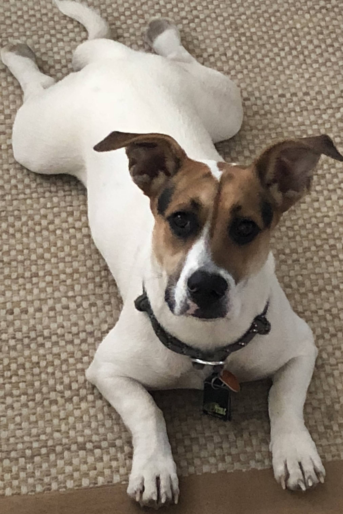

Ollie and I have been working together since we met. There have only been a handful nights away from each other. He is so much fun and makes sure I take breaks regularly to take him on walks or play. He will sit next to my chair and "groan" at me until I look down. This usually breaks my concentration and I realize it is time to move.
He has many positions that he is comfortable in and this flat position is my favorite. It doesn't matter what type of surface he is on. Could be gravel, or grass.

One of Ollie's many quirks is he does not like to get his toes muddy. He will jump over or go the long way around if needed. In dire situations he will put his toes in only if there are no other options. 😂

[gatsby]: https://github.com/gatsbyjs/gatsby
[df]: https://daringfireball.net/colophon/
[vscode]: https://code.visualstudio.com/
[hyper]: https://hyper.is/
[media-temple]: https://mediatemple.net
[remark]: https://www.npmjs.com/package/remark
[gatsby-plugin-catch-links]: https://www.npmjs.com/package/gatsby-plugin-catch-links
[gatsby-plugin-styled-components]: https://www.npmjs.com/package/gatsby-plugin-styled-components
[gatsby-source-filesystem]: https://www.npmjs.com/package/gatsby-source-filesystem
[gatsby-transformer-remark]: https://www.npmjs.com/package/gatsby-transformer-remark
[gatsby-remark-copy-linked-files]: https://www.npmjs.com/package/gatsby-remark-copy-linked-files
[gatsby-remark-prismjs]: https://www.npmjs.com/package/gatsby-remark-prismjs
[gatsby-remark-smartypants]: https://www.npmjs.com/package/gatsby-remark-smartypants
[gatsby-plugin-react-helmet]: https://www.npmjs.com/package/gatsby-plugin-react-helmet
[gatsby-plugin-offline]: https://www.npmjs.com/package/gatsby-plugin-offline
[styled-components]: https://www.styled-components.com/
[google-fonts]: https://fonts.google.com/
[webfontloader]: https://github.com/typekit/webfontloader
