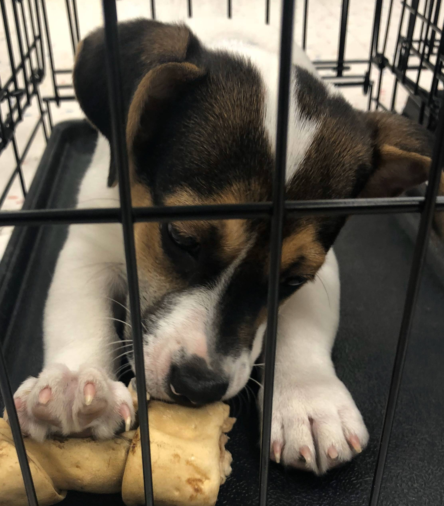

Ollie and I met unexpectedly at a pet store. I went in to see how the dog rescue runs their adoptions and how the dogs are treated. As I approached the back area where the adoption is being held it got louder with barking. I could tell it was nervous and anxious barking. There were a few people walking around with dogs on leashes and right away you could tell it was their first date. I paused to watch the activity and decide if I should continue into the room where the adoptees were being held. It was mostly empty so I decided to go in and walk around to get a closer look at the dogs. Many were barking at the front of their crates and others were pacing. I felt anxious for them, knowing they were not sure what was going on. There was a pen with puppies that were all spoken for, I kept going. I went to the far wall and walked by the dogs. At first I slowly walked past each dog trying to get a sense of them. But realized quickly this made most of them anxious. So I started looking ahead at the dogs and not stopping. I turned a corner and there was this small white dog laying in his crate chewing on a bone not bothered by the chaos. I went over and knelt down next to his crate and realized he was a puppy. He jumped up and came over wagging. I stuck my finger in and he sniffed, licked it. Then went back to chewing his bone. I was amazed that he was not at all worried about what was going on around him. He was adorable but was going to be a small dog. I was not there for a dog let alone a small dog! I turned around to walk the rest of the room and made it about 5 steps before I was turning around to kneel by the crate. ”You need to wait” is what I told myself. “This is just a trip to see what kind of dogs are here.” I I stood up and went to the table and asked if I could hold this dog. Sure, which one? I took the lady over and she said “Ollie want to go for a walk?”. He jumped up and came to the door. I took Ollie out into the aisle of the store. He was so rollie pollie the leash did not stay and off he ran! “Ollie come back!” and Ollie immediately turned around and ran into my arms! “Well, that is it” I thought. What other 3 month old puppy would listen like that. I picked him up and went to the table and said how do I take him home! I believe that Ollie and I are meant for each other!

[gatsby]: https://github.com/gatsbyjs/gatsby
[df]: https://daringfireball.net/colophon/
[vscode]: https://code.visualstudio.com/
[hyper]: https://hyper.is/
[media-temple]: https://mediatemple.net
[remark]: https://www.npmjs.com/package/remark
[gatsby-plugin-catch-links]: https://www.npmjs.com/package/gatsby-plugin-catch-links
[gatsby-plugin-styled-components]: https://www.npmjs.com/package/gatsby-plugin-styled-components
[gatsby-source-filesystem]: https://www.npmjs.com/package/gatsby-source-filesystem
[gatsby-transformer-remark]: https://www.npmjs.com/package/gatsby-transformer-remark
[gatsby-remark-copy-linked-files]: https://www.npmjs.com/package/gatsby-remark-copy-linked-files
[gatsby-remark-prismjs]: https://www.npmjs.com/package/gatsby-remark-prismjs
[gatsby-remark-smartypants]: https://www.npmjs.com/package/gatsby-remark-smartypants
[gatsby-plugin-react-helmet]: https://www.npmjs.com/package/gatsby-plugin-react-helmet
[gatsby-plugin-offline]: https://www.npmjs.com/package/gatsby-plugin-offline
[styled-components]: https://www.styled-components.com/
[google-fonts]: https://fonts.google.com/
[webfontloader]: https://github.com/typekit/webfontloader
